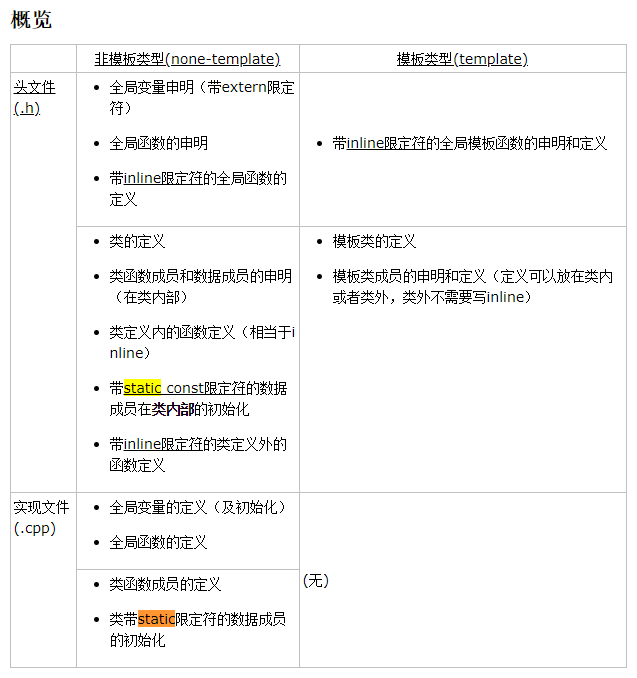

# Declaration & Definition

对于自定义类型，包括类（class）和结构体（struct），它们的定义都是放在.h文件中。其成员的声明和定义就比较复杂了，不过看上边的表格，还是比较清晰的。

**函数成员**

函数成员无论是否带有static限定符，其声明都放在.h文件的类定义内部。

对于要inline的函数成员其定义放在.h文件；其他函数的实现都放在.cpp文件中。

**数据成员**

数据成员的声明与定义都是放在.h文件的类定义内部。对于数据类型，关键问题是其初始化要放在什么地方进行。

1. 对于只含有static限定符的数据成员，它的初始化要放在**.cpp文件**中。因为它是所有类对象共有的，因此必须对它做合适的初始化。**这里的初始化，严格来说是为static数据成员分配内存。**

2. 对于只含有const限定符的数据成员，它的初始化**只能在构造函数的初始化列表**中完成。因为它是一经初始化就不能重新赋值，因此它也必须进行合适的初始化。

3. 对于既含有static限定符，又含有const限定符的数据成员，**它的初始化和定义同时进行**。它也是必须进行合适的初始化

4. 对于既没有static限定符，又没有const限定符的数据成员，它的值只针对本对象可以随意修改，因此我们并不在意它的初始化什么时候进行。

# static与const的区别

# C++ STL中，基于红黑树实现的数据结构
set和multiset
