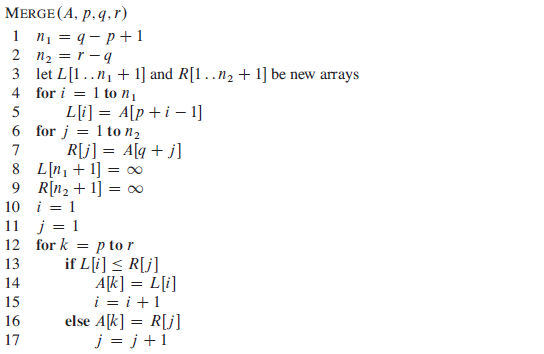

# 不同排序算法比较

# 不稳定排序的算法

口诀：快些选队。（快、希、选、堆）

1. 快速排序
2. 希尔排序
3. 选择排序
4. 堆排序

# 稳定的排序算法
1. 冒泡排序（Bubble Sort）
2. 插入排序（Insertion Sort）
3. 归并排序（Merge Sort）
4. 

# 快速排序

## 快速排序不稳定的原因

假设待排序的数组为`{1, 2, 2, 2, 4, 3, 7, 5}`。如果选择的比较子为索引为2的2，那么在`partition`阶段，数组中的三个2将有可能不在保持原有的顺序。

# 选择排序和冒泡排序
选择排序和冒泡排序非常相似，其时间复杂度都是O(n^2)。两者的比较次数是相同的，但是选择排序的交换次数比冒泡少。例如数组`{5, 4, 3, 2, 1}`，第一次循环，使用选择排序，只需要一次交换，5就跑到了数组的最后，而使用冒泡排序，需要4次交换，5才会跑到数组的最后。

## 选择排序与冒泡排序的区别

两种排序算法非常相似，区别是在交换方式上。两种算法在一次循环中都是把最大的或最小的元素筛选出来放在相应的位置上，区别是冒泡排序每次都比较和交换（有必要的前提下）相邻两项，而选择排序是比较和交换（有必要的前提下）当前项和最后一项。

冒泡排序对应的代码为

	for i:=1 to n-1 do 
		if (a[i]>a[i+1]) then swap(i,i+1);

选择排序对应的代码为
	
	for i:=1 to n-1 do 
		if (a[i]>a[n]) then swap(i,n);  

冒泡排序是每一次都可能要交换，而选择排序是在比较时记下a[i]的位置，最后来交换，所以他们的交换过程是不一样的，而查找的过程是一样的。所以选择排序效率不会比冒泡的低。

# 插入排序
## 直接插入排序
基本思想

当插入第i（i>1）个元素时，前面的data[0],data[1]……data[i-1]已经排好序。这时用data[i]的排序码与data[i-1],data[i-2],……的排序码顺序进行比较，找到插入位置即将data[i]插入，原来位置上的元素向后顺序移动。 

## 折半插入排序
基本思想

设元素序列data[0],data[1],……data[n-1]。其中data[0],data[1],……data[i-1]是已经排好序的元素。在插入data[i]时，利用折半搜索法寻找data[i]的插入位置。

## 希尔排序
这个排序方法又称为缩小增量排序。

基本思想

设待排序元素序列有n个元素，首先取一个整数increment（小于n）作为间隔将全部元素分为increment个子序列，所有距离为increment的元素放在同一个子序列中，在每一个子序列中分别实行直接插入排序。然后缩小间隔increment，重复上述子序列划分和排序工作。直到最后取increment=1，将所有元素放在同一个子序列中排序为止。 

由于开始时，increment的取值较大，每个子序列中的元素较少，排序速度较快，到排序后期increment取值逐渐变小，子序列中元素个数逐渐增多，但由于前面工作的基础，大多数元素已经基本有序，所以排序速度仍然很快。 

# 归并排序

